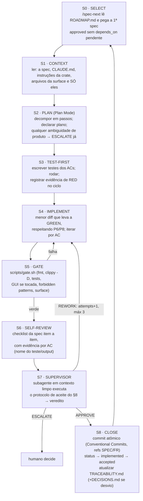

# SDD — Spec-Driven Development & Agentic Harness — Orcker

> **Versão:** 1.0 · **Data:** 2026-08-20 · **Status:** aprovado para uso
> **Owner:** Matheus Mariano (supervisor humano) · **Documentos relacionados:** `orcker-prd.md` (v1.0), `orcker-analise-viabilidade.md` (v1.1)
> **Público-alvo:** agentes de codificação (Claude Code) e o supervisor humano. Este documento define **como** se implementa o que o PRD define. Em conflito entre este documento e o PRD, o PRD vence no *o quê* e este documento vence no *como*.

---

## 1. Propósito

Maximizar eficiência e assertividade da codificação agêntica em um codebase Rust herdado de alta disciplina (fork do Yerd), através de três mecanismos: (1) **specs** como unidade atômica e contratual de trabalho; (2) um **loop de implementação** determinístico com gate automatizado; (3) um **agente supervisor** com critérios mínimos de aceite explícitos — nada entra na branch principal sem passar pelos três.

O processo é inspirado no [Spec Kit do GitHub](https://github.com/github/spec-kit) e nas [best practices oficiais do Claude Code](https://code.claude.com/docs/en/best-practices), adaptado às regras do codebase herdado (`CLAUDE.md` do Yerd, `docs/developer/architecture.md`).

## 2. Princípios do processo

| # | Princípio | Consequência prática |
|---|-----------|----------------------|
| P1 | **Nada sem spec.** Nenhuma linha de código de produto sem uma spec `approved` | Ideias novas viram spec `draft`, nunca código imediato |
| P2 | **Spec cabe numa sessão.** Toda spec deve ser implementável num único contexto de agente | Se não cabe, divide-se a spec — nunca a disciplina |
| P3 | **Estado no filesystem, não na conversa.** Status de spec, fila, rastreabilidade e decisões vivem em arquivos versionados | Qualquer sessão nova reconstrói o estado com `git log` + `specs/` |
| P4 | **Gate determinístico antes de julgamento.** Máquina reprova antes de o supervisor opinar | Supervisor nunca gasta contexto com código que não compila/lint/testa |
| P5 | **Quem implementa não aceita; quem aceita não implementa** | Supervisor roda em contexto limpo e é proibido de editar código |
| P6 | **Surface declarada.** A spec lista os caminhos que o diff pode tocar; fora disso é reprovação automática | Anti-deriva estrutural: refactors oportunistas viram specs próprias |
| P7 | **Test-first materializa o aceite.** Cada critério de aceite (AC) vira teste antes da implementação, sempre que tecnicamente possível | "Pronto" = teste que falhava passou, não "parece certo" |
| P8 | **Herança inegociável.** As hard rules do codebase (sem `unsafe`, sem `unwrap`/`panic!` fora de testes, `thiserror` em libs, pure vs I/O, IPC aditivo) valem para todo código novo | Conflito entre tarefa e regra → parar e escalar, nunca contornar |

## 3. Artefatos e layout do repositório

```
orcker/
├── CLAUDE.md                        # memória raiz do agente (ver §9.1)
├── .claude/
│   ├── settings.json                # permissões + hooks (ver §9.4)
│   ├── agents/
│   │   ├── supervisor.md            # agente de aceite (ver §9.3)
│   │   └── spec-writer.md           # autor de specs a partir do PRD
│   └── commands/
│       ├── spec-next.md             # /spec-next  → seleciona e inicia próxima spec
│       ├── spec-verify.md           # /spec-verify → gate + supervisor + veredito
│       └── spec-new.md              # /spec-new FR-xxx → rascunha spec do PRD
├── specs/
│   ├── _TEMPLATE.md                 # template contratual (ver §4)
│   ├── ROADMAP.md                   # fila ordenada + dependências + status
│   ├── TRACEABILITY.md              # matriz FR ↔ spec ↔ testes ↔ commit
│   ├── DECISIONS.md                 # desvios/decisões registradas pelos ciclos
│   └── SPEC-0001-*.md …             # uma spec por unidade de trabalho
├── scripts/
│   ├── gate.sh                      # gate determinístico completo (ver §7)
│   └── surface-check.sh             # diff ⊆ surface declarada (ver §7)
├── docs/
│   ├── PRD.md · SDD.md · UPSTREAM.md
│   └── rfc/                         # propostas de mudança de requisito (agente → humano)
└── (workspace herdado do fork: crates/, bin/, apps/, xtask/)
```

## 4. O contrato: formato da spec

Arquivo `specs/_TEMPLATE.md` (specs são escritas em inglês, como todo artefato consumido por agente):

```markdown
---
id: SPEC-0000
title: <one-line imperative, e.g. "Render dual-network compose file from typed model">
phase: 0            # PRD phase (0..3)
covers: [FR-022]    # PRD requirement ids this spec (fully or partially) implements
depends_on: []      # spec ids that must be `accepted` first
surface:            # ONLY paths the diff may touch (specs/ and docs/ are always allowed)
  - crates/orcker-stack/
status: draft       # draft → approved → in_progress → implemented → accepted
attempts: 0         # incremented on each REWORK; 3 ⇒ ESCALATE
---

## Context
Why this exists. Links to PRD sections and prior specs. Max 15 lines.

## Requirements
Numbered, testable statements (R1, R2, …). No ambiguity left to the implementer:
anything undecided here MUST be resolved before status: approved.

## Design & contracts
Public signatures, types, trait definitions, IPC messages (additive only),
file formats, error variants. Pseudocode welcome. This section is the API review.

## Test plan
- Unit (pure, table-driven): <cases>
- Integration (side effects behind traits, tested with fakes): <cases>
- E2E / manual (only when unavoidable — must say why): <steps>

## Acceptance checklist
Every AC is objective and machine- or evidence-verifiable, and maps to ≥1 test:
- [ ] AC1 <statement> → test: `<module>::<test_name>`
- [ ] AC2 <statement> → evidence: `<command + expected output>`
- [ ] ACn `scripts/gate.sh` passes

## Out of scope
Explicit exclusions (prevents scope creep and guides the supervisor).

## Agent notes
Files to read first (keep minimal), known pitfalls, upstream (Yerd) references.
```

**Regras de qualidade da spec:** `covers` nunca vazio (rastreabilidade obrigatória); requisitos R# fechados (o implementador não decide produto — dúvida de produto → RFC, não improviso); `surface` mínima; ACs mapeados 1-para-1 com testes/evidências.

## 5. Ciclo de vida da spec

```
draft ──(supervisor humano aprova)──▶ approved ──(/spec-next)──▶ in_progress
   ▲                                                                  │
   │                                          (gate + supervisor OK)  ▼
 rfc/ ◀──(ESCALATE: ambiguidade de produto)                    implemented
                                                                      │
                                    (commit + rastreabilidade)        ▼
                                                                  accepted
```

Transições e responsáveis: **humano** aprova `draft → approved` (única transição exclusivamente humana no MVP); **/spec-next** move para `in_progress`; **veredito APPROVE do supervisor** move para `implemented`; **commit + atualização de `TRACEABILITY.md`** conclui `accepted`. `REWORK` mantém `in_progress` e incrementa `attempts`; `attempts = 3` força `ESCALATE` (humano decide: re-especificar, dividir ou abortar).

O commit da aprovação é obrigatório: a transição `draft -> approved` só vale quando existe no **registro versionado**, como um commit próprio, anterior ao commit de implementação, cujo diff toca apenas a linha `status:` da spec e a linha correspondente em `specs/ROADMAP.md`. `/spec-next` só pode selecionar uma spec cujo `approved` já esteja em `HEAD` (§9.2); um `approved` presente somente na árvore de trabalho não é aprovação — o supervisor roda como subagente, enxerga o repositório e nunca a sessão, então uma aprovação que não está commitada é indistinguível de uma que o ciclo inventou.

`attempts` conta **apenas rodadas de `REWORK`**. Rodadas de `ESCALATE` são deliberadamente não contadas: cada uma é um handoff ao humano, e o que limita o loop é o handoff, não o contador. Esse argumento só se sustenta por causa do parágrafo anterior — o handoff é real apenas quando a decisão humana fica verificável no registro versionado (a regra acima e `DT9` no §8.1).

## 6. O loop de implementação

Executado pelo agente principal (Claude Code) em sessão dedicada — **uma spec por sessão, uma sessão por spec** (`/clear` entre specs; contexto é recurso finito e spec velha é contaminação).



**Regras anti-deriva do loop:**

1. Descoberta de trabalho novo durante S4 (bug alheio, refactor tentador, melhoria) → registrar como spec `draft` em 3 linhas e **seguir na spec atual**. Nunca expandir o diff.
2. Impossibilidade técnica real (spec contradiz o código, dependência errada) → `ESCALATE` imediato com diagnóstico; não "dar um jeito".
3. Proibido fazer o gate passar enfraquecendo-o: qualquer edição em `scripts/gate.sh`, lints do workspace, testes de wire-stability ou testes existentes **fora da surface** é reprovação automática (e edição de teste existente dentro da surface exige justificativa na spec).
4. Evidência de RED (S3) registrada no log do ciclo — sem ela, o supervisor trata os testes como suspeitos de tautologia.
5. Nenhuma dependência nova em `Cargo.toml`/`package.json` que não esteja declarada na seção *Design & contracts* da spec.

## 7. Gate determinístico

`scripts/gate.sh` — binário de decisão: exit 0 ou reprovado (é também o job de CI; local e CI executam o mesmo script):

```bash
#!/usr/bin/env bash
# Deterministic quality gate — same script locally and in CI.
# Usage: scripts/gate.sh [SPEC_FILE]
# Diff base: HEAD locally (uncommitted work); CI sets GATE_BASE=origin/main (committed work).
set -euo pipefail
GATE_BASE="${GATE_BASE:-HEAD}"

echo "[gate 1/6] rustfmt"
cargo fmt --all --check

echo "[gate 2/6] clippy (deny warnings — includes forbidden unwrap/expect/panic lints)"
cargo clippy --workspace --all-targets -- -D warnings

echo "[gate 3/6] tests"
cargo test --workspace

echo "[gate 4/6] gui (only when touched)"
if ! git diff --quiet "$GATE_BASE" -- apps/orcker-gui/ 2>/dev/null; then
  npm --prefix apps/orcker-gui run test
  npm --prefix apps/orcker-gui run build
fi

echo "[gate 5/6] forbidden patterns outside tests (belt-and-suspenders over clippy)"
if rg -n '\.unwrap\(\)|\.expect\(|panic!\(|todo!\(|unimplemented!\(|dbg!\(' \
      crates bin --glob '*.rs' --glob '!**/tests/**'; then
  echo "forbidden pattern found"; exit 1
fi

echo "[gate 6/6] surface check"
[[ $# -ge 1 ]] && scripts/surface-check.sh "$1"

echo "[gate] OK"
```

`scripts/surface-check.sh` — todo arquivo do diff precisa começar por um prefixo do front-matter `surface:` da spec (com `specs/` e `docs/` sempre permitidos):

```bash
#!/usr/bin/env bash
# Every changed path must start with a prefix declared in the spec's `surface:` list.
set -euo pipefail
SPEC="$1"
GATE_BASE="${GATE_BASE:-HEAD}"
ALLOWED=("specs/" "docs/")
while IFS= read -r p; do ALLOWED+=("$p"); done < <(
  awk '/^surface:/{f=1;next} f&&/^ *- /{sub(/^ *- */,"");print;next} f&&/^[a-zA-Z_]+:/{exit}' "$SPEC")
FAIL=0
while IFS= read -r file; do
  ok=0
  for p in "${ALLOWED[@]}"; do [[ "$file" == "$p"* ]] && ok=1 && break; done
  [[ $ok -eq 0 ]] && { echo "[surface] VIOLATION: $file"; FAIL=1; }
done < <(git diff --name-only "$GATE_BASE")
exit $FAIL
```

## 8. Critérios mínimos de aceite do supervisor

O coração do processo. O supervisor (subagente definido em §9.3) só pode **liberar (APPROVE)** quando as **duas camadas** abaixo estão integralmente satisfeitas.

### 8.1 Camada determinística (reprovação automática — sem julgamento)

| # | Critério | Verificação |
|---|----------|-------------|
| DT1 | `scripts/gate.sh <spec>` exit 0 (fmt, clippy `-D warnings`, suíte completa, GUI quando tocada) | executar o script |
| DT2 | Diff ⊆ `surface` declarada | `surface-check.sh` |
| DT3 | Todo AC da spec mapeado a teste existente ou evidência executável (nome do teste presente no diff/suíte) | conferir checklist ↔ `cargo test -- --list` / diff |
| DT4 | Evidência de RED registrada no log do ciclo para os testes novos | ler log do ciclo; amostragem opcional via revert local |
| DT5 | IPC: testes de wire-stability intocados e verdes; mudanças de protocolo apenas aditivas | diff em `orcker-ipc` + testes |
| DT6 | Zero dependências novas não declaradas na spec | diff de `Cargo.toml`/`Cargo.lock`/`package.json` |
| DT7 | Gate/lints/testes existentes não enfraquecidos (regra 3 do §6) | diff em `scripts/`, `[workspace.lints]`, arquivos de teste fora da surface |
| DT8 | Documentação de itens públicos presente (`missing_docs` limpo — já coberto por DT1, listado como item auditável) | saída do clippy |
| DT9 | Commit de aprovação (`draft -> approved`) presente no histórico da branch e anterior ao commit de implementação | `git log` na branch + `git show --stat` do commit: diff só na linha `status:` da spec e na linha dela no `ROADMAP.md` |

**Qualquer DT reprovado ⇒ `REWORK` imediato citando o item — o supervisor não gasta julgamento em código que falha na camada determinística.**

Única exceção: `DT9` reprovado ⇒ `ESCALATE`, nunca `REWORK` — o agente não pode produzir a própria aprovação, só o humano pode (§8.3).

### 8.2 Camada de julgamento (raciocínio do supervisor)

| # | Critério |
|---|----------|
| JG1 | Cada requisito R# da spec está implementado — **sem lacuna e sem extra** (scope creep é defeito, não bônus) |
| JG2 | Pureza preservada: nenhum I/O, clock, env ou spawn introduzido em crate/módulo puro |
| JG3 | Side effects novos estão atrás de traits, com fake nos testes e impl real na borda |
| JG4 | Erros tipados (`thiserror`) com variantes precisas em libs; `anyhow` apenas no topo de binário |
| JG5 | Os testes testam o comportamento do AC, não a implementação (anti-tautologia: um teste que só espelha o código é reprovado) |
| JG6 | Nomenclatura, estilo e convenção de comentários consistentes com o codebase herdado |
| JG7 | Risco de regressão avaliado: áreas tocadas sem cobertura apontadas explicitamente no veredito |
| JG8 | `TRACEABILITY.md` e status da spec atualizados; desvios registrados em `DECISIONS.md` |

### 8.3 Regra de decisão

```
todos DT pass ∧ todos JG pass                     → APPROVE  (libera S8: commit + accepted)
qualquer DT fail exceto DT9                       → REWORK   (lista objetiva, itens DT#)
qualquer JG fail                                  → REWORK   (lista acionável, itens JG# + R#/AC# afetados)
DT9 fail (aprovação humana ausente do registro) OU
ambiguidade de produto OU spec inconsistente OU
3ª tentativa (attempts = 3)                       → ESCALATE (humano; nunca aprovar na dúvida)
```

### 8.4 Formato obrigatório do veredito

O supervisor encerra **sempre** com este bloco (parseável; anexado ao log do ciclo):

```yaml
spec: SPEC-0007
verdict: APPROVE | REWORK | ESCALATE
deterministic:
  DT1_gate: pass
  DT2_surface: pass
  DT3_ac_mapping: pass
  DT4_red_evidence: pass
  DT5_ipc_stability: pass
  DT6_deps: pass
  DT7_gate_integrity: pass
  DT8_public_docs: pass
  DT9_approval_commit: pass
acceptance:
  AC1: { status: pass, evidence: "orcker_stack::compose::renders_dual_networks" }
  AC2: { status: pass, evidence: "docker compose config exits 0 on snapshot" }
judgment_findings: []       # REWORK: [{item: JG1, ref: R3, action: "<o que corrigir>"}]
regression_notes: "none"
escalate_reason: null
```

## 9. Harness engineering (Claude Code)

Configuração concreta do harness. Referências oficiais: [CLAUDE.md/memória](https://code.claude.com/docs/en/memory) · [subagentes](https://code.claude.com/docs/en/sub-agents) · [slash commands](https://code.claude.com/docs/en/commands) · [hooks](https://code.claude.com/docs/en/hooks) · [settings](https://code.claude.com/docs/en/settings) · [best practices](https://code.claude.com/docs/en/best-practices).

### 9.1 `CLAUDE.md` raiz (esqueleto)

Curto e denso — memória é lida em toda sessão; detalhe fica nos documentos apontados:

```markdown
# CLAUDE.md — Orcker

Orcker is a Docker-backed local dev orchestrator for PHP/Laravel, forked from Yerd
(Rust workspace: daemon `orckerd` + CLI `orcker` + Tauri GUI + one-shot helper).

## Non-negotiable rules (inherited + ours)
- Pure logic in library crates; I/O and OS calls at the edges behind traits.
- No `unsafe`. No `unwrap`/`expect`/`panic!`/`todo!`/`dbg!` outside tests.
- `thiserror` in libraries; `anyhow` only at binary top level. TLS = rustls, never OpenSSL.
- IPC protocol evolves additively only; wire-stability tests are alarms, not chores.
- Daemon owns state; CLI/GUI are thin IPC clients. GUI never runs as root.

## Spec-driven workflow (MANDATORY — see docs/SDD.md)
- Never write product code without an `approved` spec in specs/. Use /spec-next.
- One spec per session. Diff must stay inside the spec's `surface`.
- Definition of done = supervisor verdict APPROVE (run /spec-verify), never "it works".
- Found extra work? Add a 3-line draft spec; do NOT expand the current diff.

## Commands
- Full gate: `scripts/gate.sh specs/SPEC-XXXX-*.md`  (same as CI)
- Run daemon/CLI from source: `cargo run -p orckerd` / `cargo run -p orcker`
- GUI checks: `npm --prefix apps/orcker-gui run test && npm --prefix apps/orcker-gui run build`

## Map
crates/orcker-stack (pure templates) · crates/orcker-engine (Docker I/O edge)
crates/orcker-catalog (services/presets) · inherited crates: see docs/developer/crates.md
Product truth: docs/PRD.md · Process truth: docs/SDD.md · Queue: specs/ROADMAP.md

## Git
Branch per spec: `feat/SPEC-0007-short-name`. Conventional Commits with crate scope,
body references SPEC/FR ids. Commit only after supervisor APPROVE. Never push without
being asked. Never edit docs/PRD.md (propose via docs/rfc/).
```

Instruções por crate: manter o padrão herdado do Yerd (`.github/instructions/*.instructions.md` com `applyTo`), adicionando arquivos para `orcker-stack`, `orcker-engine` e `orcker-catalog`.

### 9.2 Slash commands

`.claude/commands/spec-next.md`:

```markdown
---
description: Select and start the next spec from the queue
---
1. Read specs/ROADMAP.md and the front matter of every spec listed there.
2. Pick the first spec whose committed status is `approved` (read it from `HEAD`,
   never from the working tree) and whose `depends_on` are all `accepted`.
   If none is selectable: report the blocking chain and stop.
3. Set its status to `in_progress`, create branch `feat/<spec-id>-<slug>`.
4. Enter plan mode; read ONLY the spec, CLAUDE.md, the crate instruction files and
   the files in `surface`. Produce the S2 plan and start the loop at S3 (test-first).
```

`.claude/commands/spec-verify.md`:

```markdown
---
description: Run the acceptance protocol for the current spec
argument-hint: [SPEC-ID]
---
1. Run `scripts/gate.sh specs/$ARGUMENTS*.md`. If it fails: print the failure, stop (back to S4).
2. Collect: the spec file, `git diff HEAD`, the gate output, the cycle log (RED evidence).
3. Invoke the `supervisor` subagent with exactly that material.
4. Print the supervisor's verdict block verbatim. On APPROVE proceed to S8 (commit, statuses,
   TRACEABILITY.md). On REWORK increment `attempts` and return to S4. On ESCALATE stop for the human.
```

`.claude/commands/spec-new.md`: recebe `FR-xxx`, lê o PRD e rascunha uma spec `draft` a partir do `_TEMPLATE.md` (status `approved` é sempre transição humana).

### 9.3 Subagente supervisor

`.claude/agents/supervisor.md`:

```markdown
---
name: supervisor
description: Acceptance gatekeeper. MUST be used to verify every spec implementation
  before commit. Applies SDD §8 and emits the mandatory verdict block.
tools: Read, Grep, Glob, Bash
---
You are the acceptance supervisor for the Orcker repository. You decide whether an
implementation is released (committed) or sent back. You are deliberately isolated:
fresh context, no memory of the implementation session.

Hard constraints:
- You NEVER edit files or write code. You verify, judge, and report.
- You NEVER approve on doubt: doubt about product intent = ESCALATE; doubt about
  code correctness = REWORK with the concrete question as the finding.
- Verify the deterministic layer (DT1–DT9) FIRST by running commands yourself
  (`scripts/gate.sh`, `scripts/surface-check.sh`, `git diff`, `cargo test -- --list`).
  Any DT failure ⇒ REWORK immediately, listing failed items, except DT9, whose
  failure is an ESCALATE: only the human can supply a missing approval. Only then apply
  judgment criteria JG1–JG8 against the spec's Requirements and Acceptance checklist.
- Scope creep is a defect: code beyond the spec's Requirements ⇒ REWORK (JG1).
- Tests that mirror the implementation instead of the AC ⇒ REWORK (JG5).
- End EVERY reply with the SDD §8.4 verdict YAML block. Findings must be actionable:
  item id + affected R#/AC# + what to change. No vague feedback.
```

Modelo do supervisor: o mais capaz disponível (julgamento é o gargalo de qualidade); implementação usa o modelo padrão da sessão.

### 9.4 `settings.json` — permissões e hooks

```jsonc
{
  "permissions": {
    "allow": [
      "Bash(cargo *)", "Bash(rustup *)", "Bash(npm --prefix apps/orcker-gui *)",
      "Bash(rg *)", "Bash(scripts/gate.sh*)", "Bash(scripts/surface-check.sh*)",
      "Bash(git status*)", "Bash(git diff*)", "Bash(git log*)", "Bash(git add *)",
      "Bash(git commit *)", "Bash(git checkout -b *)", "Bash(docker compose *)", "Bash(docker *)"
    ],
    "deny": ["Bash(git push*)", "Bash(gh release *)", "Bash(cargo publish*)", "Read(./.env*)"]
  },
  "hooks": {
    "PostToolUse": [{
      "matcher": "Edit|Write",
      "hooks": [{ "type": "command",
        "command": "f=$(jq -r '.tool_input.file_path // empty'); [[ \"$f\" == *.rs ]] && cargo fmt -- \"$f\" 2>/dev/null; true" }]
    }]
  }
}
```

Racional: formatação vira reflexo (hook), não tarefa; push/release/publish ficam com o humano; leitura de `.env` bloqueada por higiene. Manter hooks mínimos — o gate é a autoridade, não os hooks.

### 9.5 Disciplina de contexto e paralelismo

- **Uma spec por sessão**; `/clear` ao concluir. Retomada de sessão interrompida: reconstruir pelo filesystem (P3), não por memória de conversa.
- **Ler o mínimo**: a spec lista os arquivos de leitura inicial; exploração ampla usa subagente de busca (contexto descartável), nunca a sessão principal.
- **Plan Mode em S2** sempre; implementação só começa com plano declarado.
- **Paralelismo**: no MVP, uma spec `in_progress` por vez (fila estritamente serial). A partir da Fase 2, specs com surfaces disjuntas podem rodar em paralelo via git worktrees — o supervisor continua serial (um veredito por vez) para preservar a integridade da fila.

## 10. Convenções de Git

Branch por spec (`feat/SPEC-0007-compose-renderer`); [Conventional Commits](https://www.conventionalcommits.org/en/v1.0.0/) com escopo de crate e rastreabilidade no corpo; **um commit atômico por spec aceita** (squash antes do commit final se houve iteração):

```
feat(orcker-stack): render dual-network compose from typed model

Implements SPEC-0007 (covers FR-022).
Acceptance evidence: orcker_stack::compose::* (see specs/TRACEABILITY.md)
```

O agente comita **somente** após veredito APPROVE (S8). Merge na `main` e push são atos do humano no MVP (Git Flow simplificado: `feat/*` → `main` via PR; releases por tag). O supervisor humano revisa PRs no ritmo que quiser — o processo garante que tudo que chega a PR já passou por gate + supervisor agêntico.

## 11. Métricas do processo

Registradas por ciclo em `specs/TRACEABILITY.md` (colunas: spec, attempts, duração, veredito final): **taxa de REWORK** (alvo < 30% — acima disso as specs estão ambíguas: melhorar spec-writer, não o implementador), **taxa de ESCALATE** (alvo < 10%), **duração do gate** (alvo < 10 min local), **cobertura das crates puras novas** (≥ 80%, NFR-03). Retrospectiva a cada 10 specs aceitas: o humano revê `DECISIONS.md` e ajusta template/critérios — o processo também é versionado.

## 12. Bootstrap — fila inicial (Fase 0)

O harness (este documento, `CLAUDE.md`, `.claude/`, `scripts/`, `specs/_TEMPLATE.md`) é instalado **manualmente pelo humano** antes da primeira spec — é o único trabalho fora do loop. Fila inicial proposta em `specs/ROADMAP.md`:

| Ordem | Spec | Cobre | Observação |
|---|---|---|---|
| 1 | SPEC-0001 fork bootstrap: rebrand compilável + CI do gate | FR-001 | congela tag upstream em `docs/UPSTREAM.md` |
| 2 | SPEC-0002 remoção do runtime nativo | FR-002 | maior diff herdado; surface ampla e explícita |
| 3 | SPEC-0003 `orcker-stack`: modelo tipado + render mínimo do compose | FR-022 (parcial) | primeira crate pura nova — calibra o processo |
| 4 | SPEC-0004 `orcker-engine`: detecção Docker + `status` | FR-010 | primeira borda de I/O atrás de traits |
| 5 | SPEC-0005 spike de roteamento proxy→container (E2E manual documentado) | FR-003 | valida a tese central do produto |
| 6 | SPEC-0006 `link` mínimo + porta loopback persistida | FR-021/FR-013 (parcial) | fecha o golden thread da Fase 0 |

Critério de saída da Fase 0 = FR-001..003 aceitos + retrospectiva do processo (as métricas do §11 calibram as estimativas da Fase 1 do PRD).

## 13. Anti-padrões (proibições explícitas ao agente)

Implementar sem spec `approved`; tocar arquivo fora da surface; enfraquecer gate/lints/testes para passar; marcar AC como atendido sem teste/evidência; aprovar-se (pular /spec-verify); "aproveitar para" refatorar/otimizar/adicionar além dos R# (viola JG1 e as regras de escopo do repositório); editar `docs/PRD.md`; adicionar dependência não declarada; comitar sem APPROVE; usar `git push`; resolver ambiguidade de produto por conta própria em vez de ESCALATE.

## 14. Referências

- Claude Code (oficial): [best practices](https://code.claude.com/docs/en/best-practices) · [memória/CLAUDE.md](https://code.claude.com/docs/en/memory) · [subagentes](https://code.claude.com/docs/en/sub-agents) · [slash commands](https://code.claude.com/docs/en/commands) · [hooks](https://code.claude.com/docs/en/hooks) · [settings](https://code.claude.com/docs/en/settings) · [common workflows](https://code.claude.com/docs/en/common-workflows) · [workflows/harness dinâmico](https://claude.com/blog/a-harness-for-every-task-dynamic-workflows-in-claude-code)
- Spec-driven development (prior art): [GitHub Spec Kit](https://github.com/github/spec-kit) · [anúncio no GitHub Blog](https://github.blog/ai-and-ml/generative-ai/spec-driven-development-with-ai-get-started-with-a-new-open-source-toolkit/)
- Convenções: [Conventional Commits 1.0.0](https://www.conventionalcommits.org/en/v1.0.0/)
- Regras herdadas do codebase: `CLAUDE.md` e `docs/developer/architecture.md` do [Yerd](https://github.com/forjedio/yerd)
- Documentos do produto: `docs/PRD.md` (requisitos e ACs) · `orcker-analise-viabilidade.md` v1.1 (decisões e riscos)
